# Coding Platform APIs

## To run the server locally

```bash
git clone 
cd Coding_platform/
```

## Install packages

**Note:- Use npm package manager to install the packages**

```bash
npm install
```

## To run the server at localhost 5000

```bash
node index
```

# API Doc

**All endpoints:-**

User endpoints
- signUp (admin/participant)
- login
- getUser 

Question endpoints
- createQuestion (admin only)
- createTestCase (admin only)
- submitSolution
- fetchResult
- updateQuestion (admin only)
- deleteQuestion (admin only)
- fetchQuestion

## Examples

1. signUp

**Admin**

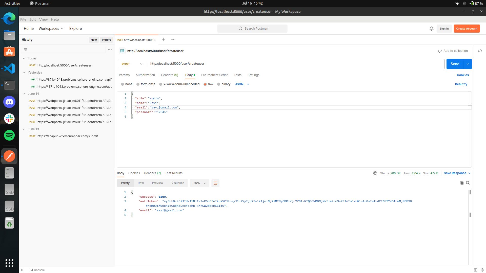

**Participant**

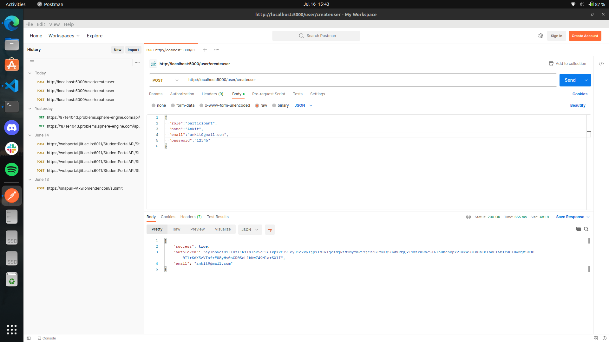

2. login

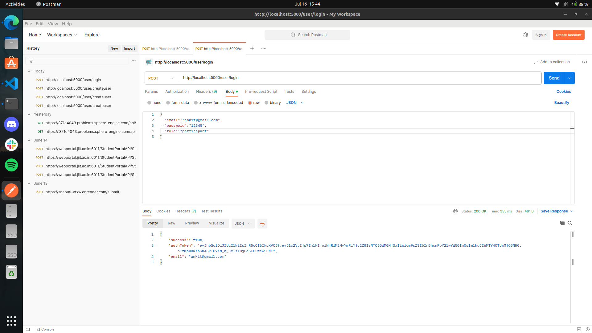

3. getUser

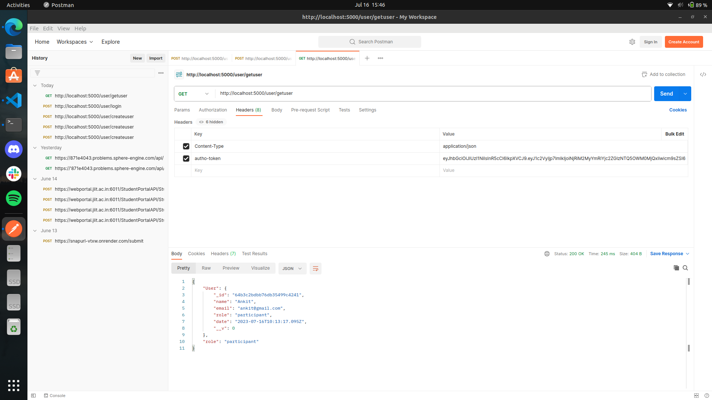

4. createQuestion

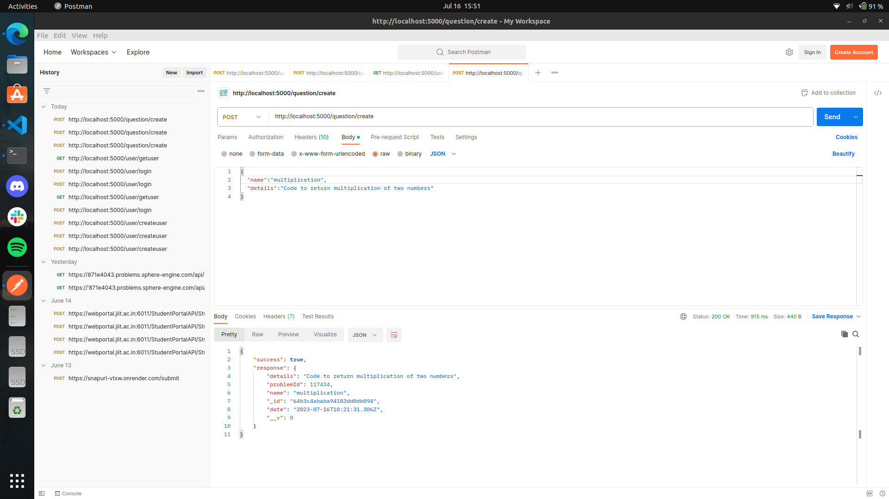

5. createTestCase

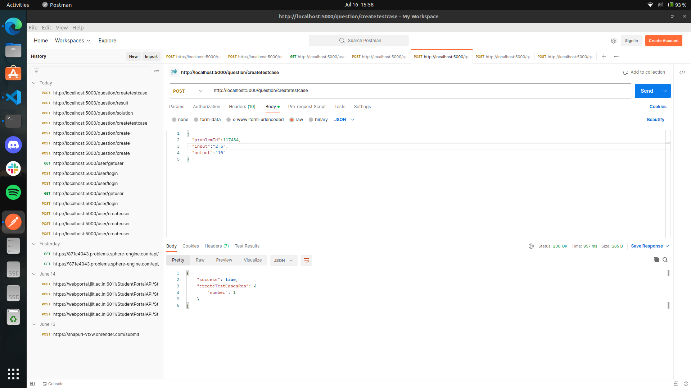

6. submitSolution


7. fetchResult

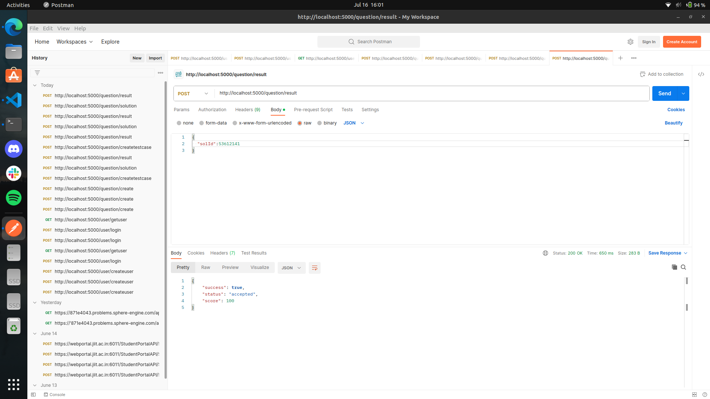

8. updateProblem

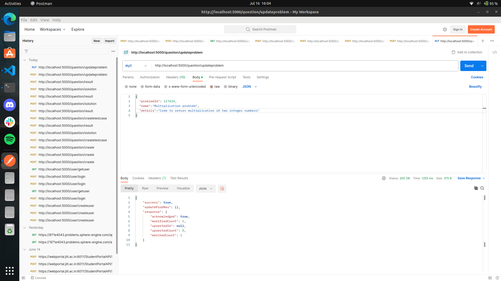

9. deleteProblem

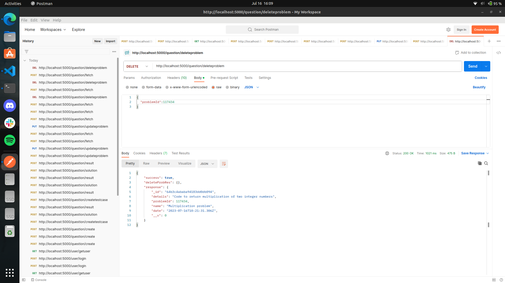

10. fetchAllQuestion

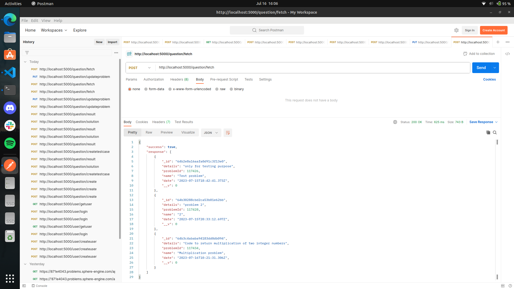

11. fetchDesiredNoQuestion

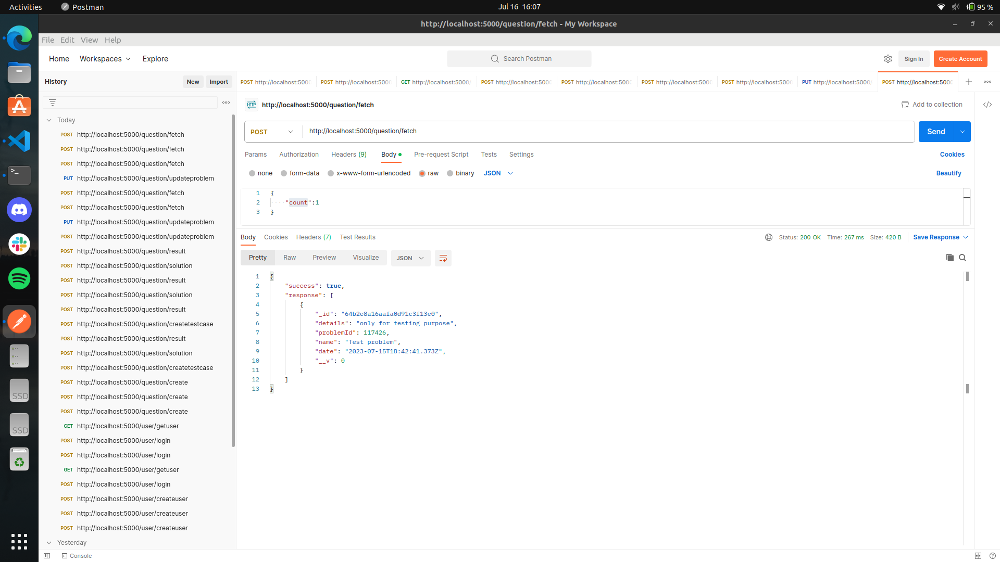
